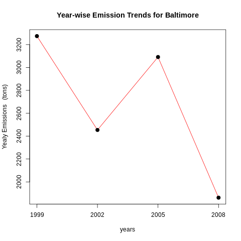
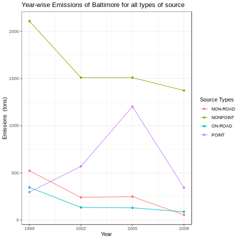
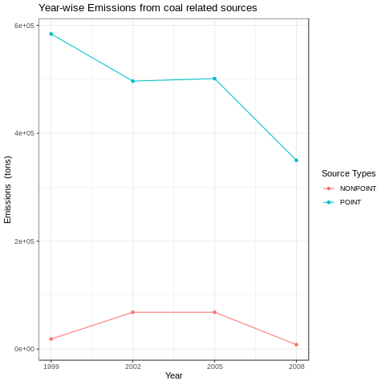

# ExploratoryJHUassignment
Exploratory Analysis on pm2.5 emission levels recorded by EPA. Coursera Assignment<br><br><br>

*Individual R files do have dataset loading statements of their own.*  
*However if testing the code from here, do include the following dataset loading commands*

Load the dataset as : 

```R
NEI <- readRDS("summarySCC_PM25.rds")
SCC <- readRDS("Source_Classification_Code.rds")
```


-----
## `PLOT 1`

> ### Have total emissions from PM2.5 decreased in the United States from 1999 to 2008? Using the base plotting system, make a plot showing the total PM2.5 emission from all sources for each of the years 1999, 2002, 2005, and 2008.

`plot1.R` can be run in the same directory as the dataset to produce `plot1.png`


```R
yearemm <- tapply(NEI$Emissions,NEI$year,sum)

plot(x = names(yearemm),y = yearemm,type="l",col='red',xlab = "years",
     ylab = "Yealy Emissions",main="Year-wise Emission Trends",
     ylim = c(2e+06,8e+06),xlim = c(1999,2008),xaxt = 'n')
     
axis(side = 1, at = seq(1999,2008,3))
points(x = names(yearemm),y = yearemm,pch = 20,cex = 2)
```

We can see a **negative trend** in emission levels of pm2.5 across years 1999 - 2008.  
This is a good sign from an environmental perspective.

<br><br><br>

---
## `PLOT 2`

> ### Have total emissions from PM2.5 decreased in the Baltimore City, Maryland (fips == "24510") from 1999 to 2008? Use the base plotting system to make a plot answering this question.

`plot2.R` can be run in the same directory as the dataset to produce `plot2.png`



```R
yearemm <- with(NEI[NEI$fips=="24510",],tapply(Emissions,year,sum))

plot(x = names(yearemm),y = yearemm,type="l",col='red',xlab = "years",
     ylab = "Yealy Emissions   (tons)",main="Year-wise Emission Trends for Baltimore",
     xlim = c(1999,2008),xaxt = 'n')

axis(side = 1, at = seq(1999,2008,3))
points(x = names(yearemm),y = yearemm,pch = 20,cex = 2)
```

Except for a **rise in Emission levels in 2002-2005 period**, Baltimore shows an **overall negative trend** in Emission levels from years 1999 to 2008.  
This is a good sign from an environmental perspective.

<br><br><br>

---
## `PLOT 3`

> ### Of the four types of sources indicated by the type(point, nonpoint, onroad, nonroad) variable, which of these four sources have seen decreases in emissions from 1999–2008 for Baltimore City? Which have seen increases in emissions from 1999–2008? Use the ggplot2 plotting system to make a plot answer this question.
 
`plot3.R` can be run in the same directory as the dataset to produce `plot3.png`



```R
baltimore_year_type <- with(NEI[NEI$fips=="24510",],
                            tapply(Emissions,list(year,type),sum))
                            
# altering the data further, cause ggplot is too picky about the data format.
df <- as.data.frame.table(baltimore_year_type)
names(df) <-  c("year","type","Emissions")
df$year <- as.numeric(as.character(df$year))

# skeleton of the plot
gg<-ggplot(df,aes(year,Emissions,col=type))+
    geom_line()+geom_point()

# tweaking the plot
gg+xlab("Year")+ylab("Emissions  (tons)")+
    labs(title = "Year-wise Emissions of Baltimore for all types of source")+
    labs(color = "Source Types")+theme_bw()+  # changing legend label and overall theme
    scale_x_continuous(breaks = unique(df$year),
                       labels = unique(df$year))
```

Except for **POINT source type emissions**, which **had a spike in 2005** but has overall stayed the same,  
**emission** through **other sources have a decreasing trend**.  
This is a good sign from an environmental perspective.

<br><br><br>


---
## `PLOT 4`

> ### Across the United States, how have emissions from coal combustion-related sources changed from 1999–2008?
 
`plot4.R` can be run in the same directory as the dataset to produce `plot4.png`




```R
#filtering SCC containing coal in their Short.Name 
scc_coal <- SCC$SCC[grep("[cC][oO][aA][lL]",SCC$Short.Name)]

coal_type <- with(NEI[NEI$SCC %in% scc_coal,],
                tapply(Emissions,list(year,type),sum))

# altering the data to make it suitable to plot
df <- as.data.frame.table(coal_type)
names(df) <-  c("year","type","Emissions")
df$year <- as.numeric(as.character(df$year))

# skeleton of the plot
gg<-ggplot(df,aes(year,Emissions,col=type))+
    geom_line()+geom_point()
    
# tweaking the plot    
gg+xlab("Year")+ylab("Emissions  (tons)")+
    labs(title = "Year-wise Emissions from coal related sources")+
    labs(color = "Source Types")+theme_bw()+
    scale_x_continuous(breaks = unique(df$year),
                       labels = unique(df$year))
```

Emission through **POINT coal sources** have a **decreasing trend** whereas, emission though **NONPOINT coal sources** have **almost stayed the same**.
