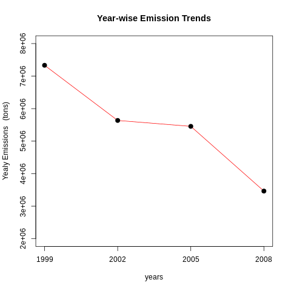

# ExploratoryJHUassignment
Exploratory Analysis on pm2.5 emission levels recorded by EPA. Coursera Assignment
  
  
  
  
  
## `PLOT 1`

### Have total emissions from PM2.5 decreased in the United States from 1999 to 2008? Using the base plotting system, make a plot showing the total PM2.5 emission from all sources for each of the years 1999, 2002, 2005, and 2008.

`plot1.R` can be run in the same directory as the datset to produce `plot1.png`

We can see a **negative trend** in emission levels of pm2.5 across years 1999 - 2008. This is a good sign from an environmental perspective.

